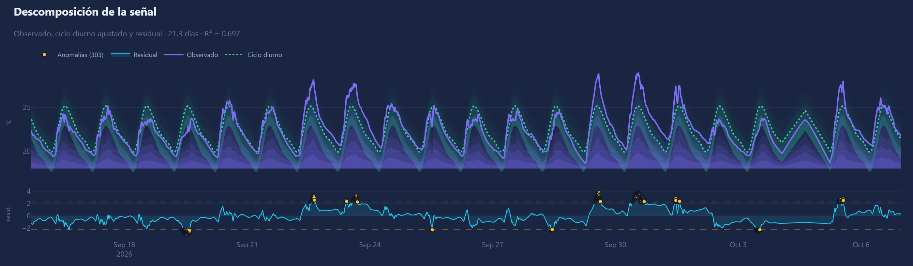
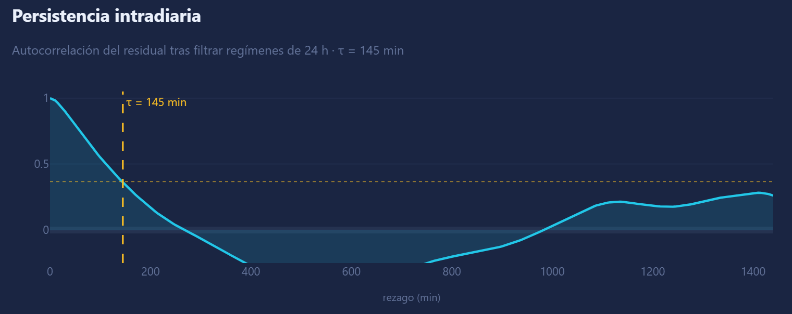
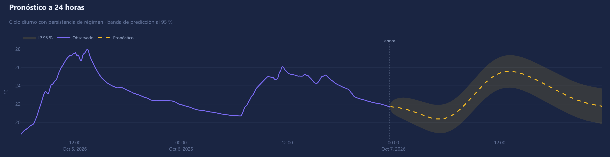

# Urban Environmental Station

[](https://doi.org/10.5281/zenodo.22740968)
[](LICENSE)
[](https://github.com/nvasquezc/urban-environmental-station/actions/workflows/firmware.yml)
[](https://github.com/nvasquezc/urban-environmental-station/actions/workflows/analysis.yml)

Estación ambiental urbana de bajo costo con trazabilidad metrológica declarada, y
una cadena de análisis que distingue lo que el instrumento mide de lo que los datos
permiten afirmar.

## Motivación

Bogotá opera cerca de veinte estaciones de referencia para una ciudad de unos ocho
millones de habitantes. La densidad espacial resultante no captura la variabilidad
intraurbana de temperatura, humedad y ruido a escala de barrio.

Los sensores de bajo costo pueden cerrar esa brecha, pero solo si su incertidumbre
está caracterizada. Este proyecto no propone reemplazar la red de referencia: propone
densificarla y, sobre todo, cuantificar cuánto se le puede creer a un sensor de bajo
costo y por cuánto tiempo.

## Pregunta de investigación

¿Es posible estimar la deriva de sensores ambientales de bajo costo a partir de los
residuales entre nodos vecinos y una estación de referencia, sin recalibración física
periódica?

## Estado

**v0.3.0 — prototipo en operación continua, sin calibrar.** Un nodo registra
temperatura, humedad relativa y presión en Bogotá desde el 15 de septiembre de 2026.
La cadena de análisis incorpora control de calidad, separación de escalas temporales,
pronóstico con persistencia de régimen validado fuera de muestra y prescripción
operativa.

Las mediciones de nivel sonoro usan un transductor sin ponderación frecuencial ni
sensibilidad declarada, y no deben usarse con fines normativos ni legales.
Ver [limitaciones conocidas](docs/06-limitaciones-conocidas.md).

## Resultados de la primera campaña

**15 de septiembre a 6 de octubre de 2026 · 21.2 días · nodo `ues-b1c9fe`**

| Indicador | Valor |
|---|---|
| Registros válidos | 5742 de 5757 (99.7 %) |
| Completitud | 94.0 % |
| Reinicios espontáneos | 0 de 8 arranques |
| Intervalos recuperados por la cola persistente | 464 |
| Registro perdido por cortes del suministro eléctrico | 28 h (4 y 5 de octubre) |



**El tiempo de decorrelación depende de la escala que se mida.** Sobre el residual
completo del ciclo diurno resulta de 1500 min, pero varía entre 340 y 1570 min según
el tramo analizado (CV = 0.77): describe el período, no el proceso. Separada la
componente intradiaria mediante un filtro pasa altos de 24 h, el valor es de 145 min
y se mantiene estable entre particiones del registro (CV de 0.07 a 0.15). Solo este
último es una propiedad del proceso, y justifica ampliar la cadencia de transmisión
de 5 a 50 minutos sin perder dinámica intradiaria.



**La autocorrelación reduce el tamaño efectivo de muestra de 5742 a 29.** Con una
autocorrelación de primer orden de 0.998, tratar las observaciones como
independientes sobreestima la significancia estadística en más de un orden de
magnitud.

**El contraste de tendencia rechazó un falso positivo.** A los nueve días, el ajuste
global detectó una deriva de +0.27 °C/día, significativa incluso tras corregir por
autocorrelación. El contraste por bloques la rechazó por heterogeneidad (CV = 1.93).
Con 21 días, la pendiente estimada cayó a +0.05 °C/día.

**El 64 % de la varianza residual corresponde a regímenes de varios días**, con una
correlación de 0.55 entre medias diarias consecutivas.

**La persistencia de régimen aporta capacidad predictiva.** En validación de origen
móvil sobre cinco ventanas de 24 h, el pronóstico alcanza una destreza de +0.36
frente a la climatología y de +0.09 frente al ciclo diurno sin persistencia. La banda
de predicción cubre el 78 % de las observaciones frente al 95 % nominal y subestima
por tanto la incertidumbre. El contraste frente a la persistencia ingenua está
pendiente.



Informe completo, con todas las figuras y cifras generadas desde los datos:
[resultados de la campaña](docs/07-resultados-campania.md).

## Consola de monitoreo

Dos vistas. La de resumen presenta el estado del instrumento, la descomposición de la
señal, la persistencia intradiaria y el contraste de tendencia. La de pronóstico aloja
la proyección a 24 horas, su validación por horizonte y las recomendaciones
operativas.

```bash
cd analysis
uv run python -m dashboard.app    # http://127.0.0.1:8050
```

Las figuras de este repositorio se generan con el mismo código que alimenta la
consola, de modo que son reproducibles a partir de los datos:

```bash
uv run python tools/exportar_figuras.py
```

## Reproducir el análisis

```bash
cd analysis
uv sync
uv run pytest -q                          # pruebas sobre datos sintéticos
uv run python tools/resumen_campania.py   # estado de la campaña
uv run python tools/estabilidad_tau.py    # prueba de estabilidad de τ
uv run python tools/exportar_figuras.py   # figuras e informe de resultados
```

Las credenciales se leen de `analysis/.env`, excluido del control de versiones:

```
FIREBASE_DB_URL=https://<proyecto>-default-rtdb.firebaseio.com
FIREBASE_SECRET=<secreto de base de datos>
UES_DEVICE_ID=<identificador del nodo>
```

Sin conexión, la consola recurre a la última copia local de los datos.

## Arquitectura

Nodo embebido → agregación de intervalos de 5 min alineados al reloj → cola
persistente en LittleFS → Firebase RTDB → control de calidad → separación de escalas
→ pronóstico y prescripción → consola.

Cada decisión de diseño, con la alternativa descartada y el costo asumido, se
documenta en [arquitectura](docs/01-arquitectura.md).

## Estructura del repositorio

```
firmware/            ESP8266 / ESP32-S3, PlatformIO
analysis/
  src/uestation/     qc · aggregate · decompose · escalas · forecast · viz
  dashboard/         consola de monitoreo (Dash)
  tools/             resumen, estabilidad de τ, exportación de figuras, diagnóstico
  tests/             pruebas sobre datos sintéticos con defectos controlados
docs/                visión, arquitectura, protocolo, esquema, limitaciones, resultados
data/reference/      metadatos de unidades y bitácora de campaña
```

## Variables medidas

| Variable | Sensor | Rango declarado | Incertidumbre |
|---|---|---|---|
| Temperatura | AHT20 | −20 a 60 °C | pendiente de co-ubicación |
| Humedad relativa | AHT20 | 0 a 100 % | pendiente de co-ubicación |
| Presión (QFE) | BMP280 | 500 a 1100 hPa | pendiente de co-ubicación |
| Nivel sonoro | DFR0034 | sin determinar | **no trazable** |

## Plataformas soportadas

| Entorno | Hardware | Frontend de sonido |
|---|---|---|
| `esp8266_d1mini` | ESP8266 D1 mini | Analógico (no trazable) |
| `esp32s3_analog` | ESP32-S3 | Analógico (no trazable) |
| `esp32s3_i2s` | ESP32-S3 | MEMS I2S con ponderación A |

## Compilar el firmware

```bash
cp firmware/include/secrets.example.h firmware/include/secrets.h
# editar secrets.h con las credenciales propias
pio run -d firmware -e esp8266_d1mini -t upload
```

Requiere PlatformIO Core >= 6.2.0 y el módulo `intelhex` para los builds de ESP32.

## Documentación

- [Visión y alcance](docs/00-vision-y-alcance.md)
- [Arquitectura](docs/01-arquitectura.md)
- [Protocolo de calibración](docs/02-protocolo-calibracion.md)
- [Esquema de datos](docs/03-esquema-de-datos.md)
- [Limitaciones conocidas](docs/06-limitaciones-conocidas.md)
- [Resultados de la campaña](docs/07-resultados-campania.md)
- [Registro de cambios](CHANGELOG.md)

## Cómo citar

Vásquez Castro, N. O. (2026). *Urban Environmental Station: estación ambiental urbana
de bajo costo con trazabilidad metrológica* (v0.3.0). Zenodo.
https://doi.org/10.5281/zenodo.22740968

Metadatos completos en [CITATION.cff](CITATION.cff).

## Licencias

Código Apache-2.0 · Documentación y datos CC BY 4.0 · Hardware CERN-OHL-P v2.
Ver [LICENSE-docs.md](LICENSE-docs.md).

## Autor

Néstor Oswaldo Vásquez Castro · [ORCID 0009-0003-6483-790X](https://orcid.org/0009-0003-6483-790X)
Jitter Ingeniería SAS / Universidad Central · Bogotá, Colombia
