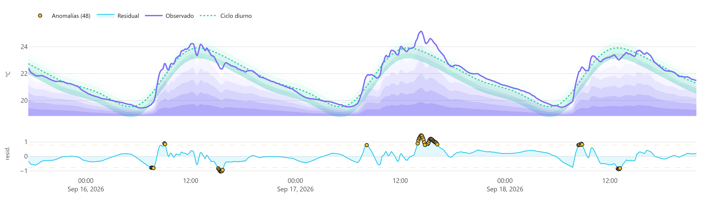
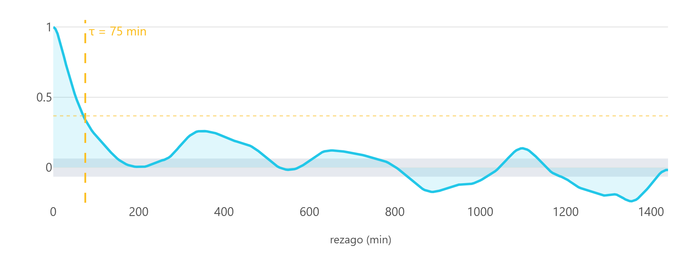
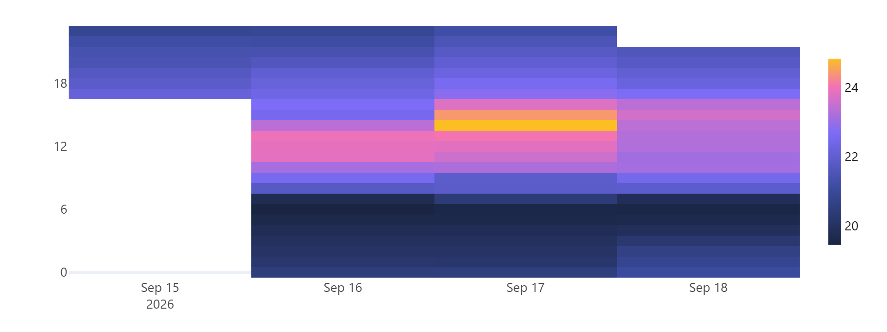
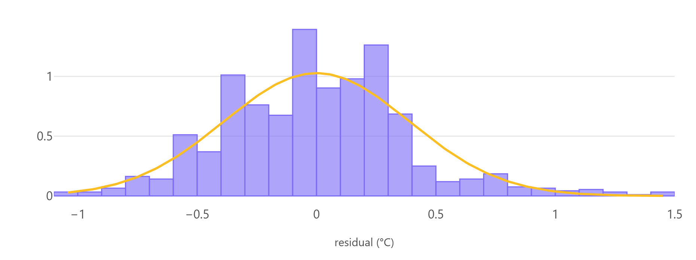
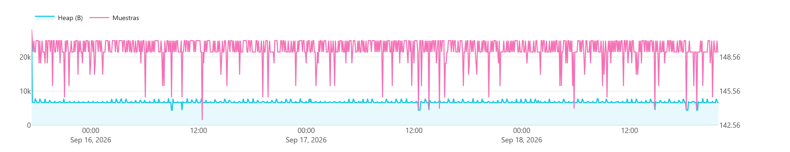

# Resultados de la campaña

<!-- Generado por analysis/tools/exportar_figuras.py el 2026-09-19 03:06 UTC. No editar a mano. -->

**Nodo:** `ues-b1c9fe`  
**Período:** 2026-09-15 17:25 a 2026-09-18 21:55 (hora local)  
**Estado de calibración:** sin calibrar

## Indicadores

| Magnitud | Valor | Observación |
|---|---|---|
| Registros válidos | 919 | de 919 evaluados |
| Completitud | 100.0% | 919 de 919 intervalos esperados |
| Varianza explicada | 0.927 | ciclo diurno, 3 armónicos |
| Dispersión residual | 0.388 °C | no explicada por el ciclo |
| Incertidumbre U (k=2) | 0.0025 °C | cota inferior, excluye calibración |
| Tiempo de decorrelación | 75 min | sobremuestreo de factor 15 |
| Arranques | 1 | 0 espontáneos |
| Deriva de memoria | -2.4 B/h | regresión sobre el período |
| Interrupciones | 0 | discontinuidades en la serie |

## Figuras

### Descomposición de la señal

El ciclo diurno ajustado mediante 3 armónicos de Fourier explica el 92.7% de la varianza observada. El residual presenta una dispersión de 0.388 °C, comparable a la incertidumbre de fábrica del sensor AHT20 (±0.3 °C).

### Estructura temporal

La autocorrelación del residual decae por debajo de 1/e a los 75 minutos, frente a un intervalo de muestreo de 5 minutos. El sistema opera con un sobremuestreo de factor 15, lo que acota empíricamente el intervalo de transmisión mínimo necesario y abre margen para reducir el consumo energético sin pérdida de contenido informativo.

### Distribución del residual

### Estabilidad del instrumento

---

**Alcance.** Lecturas sin corrección por calibración. La incertidumbre reportada recoge únicamente la dispersión intra-intervalo y constituye una cota inferior: la componente de calibración permanece indeterminada hasta completar la co-ubicación con una referencia trazable. Estos valores no deben emplearse con fines normativos.