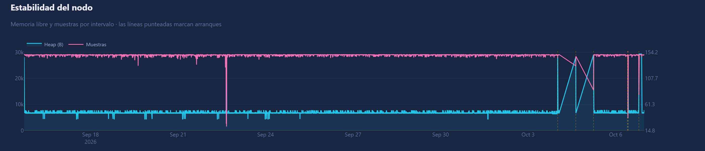
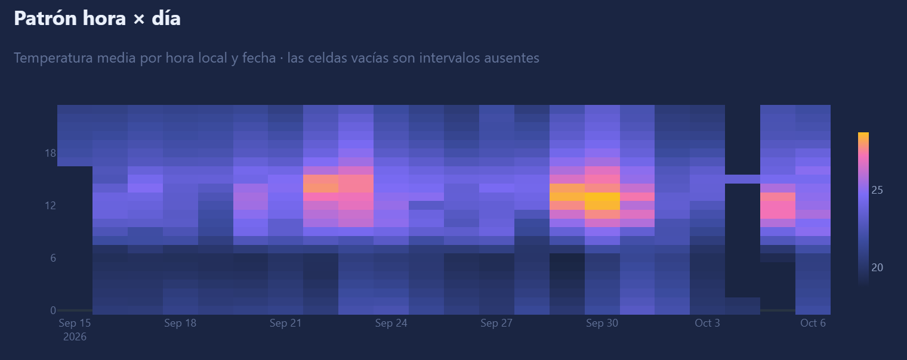
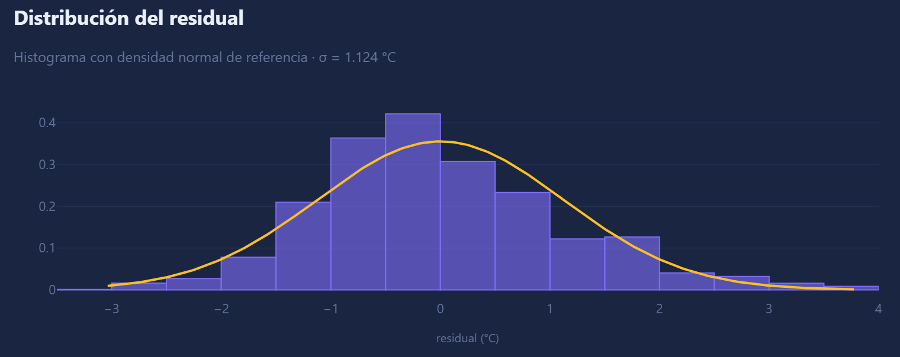
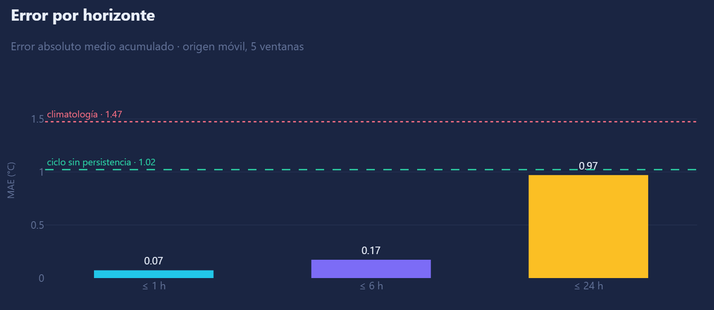

# Resultados de la campaña

<!-- Generado por analysis/tools/exportar_figuras.py el 2026-10-07 04:42 UTC. No editar a mano. -->

**Nodo:** `ues-b1c9fe`  
**Período:** 2026-09-15 17:25 a 2026-10-06 23:35 (hora local) · 21.3 días  
**Estado de calibración:** sin calibrar

## Operación

| Indicador | Valor |
|---|---|
| Registros válidos | 5757 de 5772 (99.7 %) |
| Completitud | 94.0% |
| Interrupciones | 9 · 366 intervalos · 31.2 h |
| Arranques | 8 · 0 espontáneos |
| Intervalos recuperados por la cola persistente | 465 |
| Memoria libre mínima | 4400 B · deriva +1.6 B/h |

## Señal

| Magnitud | Valor |
|---|---|
| Varianza explicada por el ciclo diurno | 0.697 |
| Dispersión residual | 1.124 °C |
| Amplitud diurna | 4.60 °C |
| Pendiente global | +0.0451 °C/día |
| Tendencia incorporada | no — pendiente por debajo del umbral de relevancia (0.1 °C/día) |
| Autocorrelación de primer orden | 0.9984 |
| Tamaño efectivo de muestra | 29 de 5757 |

## Escalas temporales del residual

| Magnitud | Valor |
|---|---|
| Tiempo de decorrelación intradiario | 145 min |
| Tiempo de decorrelación del residual completo | 1500 min |
| Fracción sinóptica de la varianza residual | 64% |
| Dispersión sinóptica | 0.876 °C |
| Dispersión intradiaria | 0.663 °C |
| Correlación entre jornadas consecutivas | +0.55 |
| Cadencia de transmisión sugerida | 50 min |

El tiempo de decorrelación del residual completo incorpora regímenes de varios días y crece con la longitud del registro: describe el período observado, no el proceso. El de la componente intradiaria, obtenido tras un filtro pasa altos de 24 h, es el que fija la cadencia de muestreo.

## Pronóstico

Validación de origen móvil sobre 5 ventanas de 24 h, cada una pronosticada con parámetros estimados exclusivamente sobre los datos que la preceden.

| Métrica | Valor |
|---|---|
| Error absoluto medio | 0.957 °C |
| Raíz del error cuadrático medio | 1.320 °C |
| Sesgo | -0.299 °C |
| Destreza frente a la climatología | +0.350 |
| Destreza frente al ciclo sin persistencia | +0.063 |
| Cobertura de la banda | 77.5% (nominal 95%) |

| Horizonte | Error absoluto medio |
|---|---|
| ≤ 1 h | 0.073 °C |
| ≤ 6 h | 0.173 °C |
| ≤ 24 h | 0.971 °C |

El error a horizontes cortos no constituye por sí solo evidencia de destreza: debe contrastarse con la persistencia ingenua del último valor.

---

**Alcance.** Lecturas sin corrección por calibración. La incertidumbre reportada recoge solo la dispersión intra-intervalo y constituye una cota inferior: la componente de calibración permanece indeterminada hasta completar la co-ubicación con una referencia trazable. Estos valores no deben emplearse con fines normativos.
